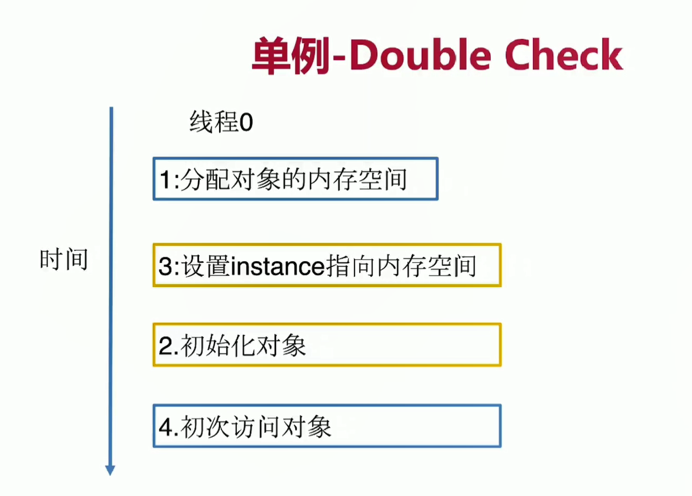
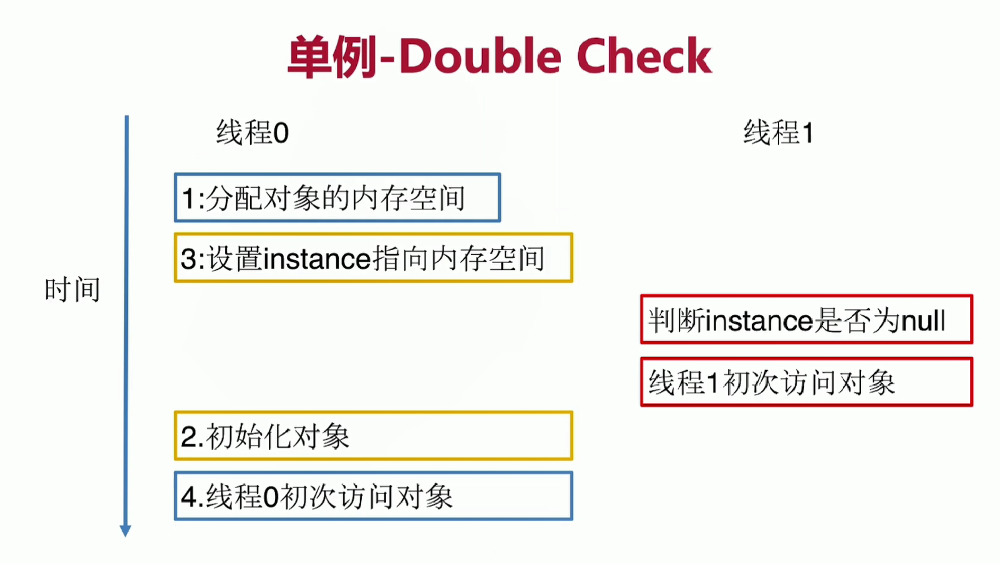
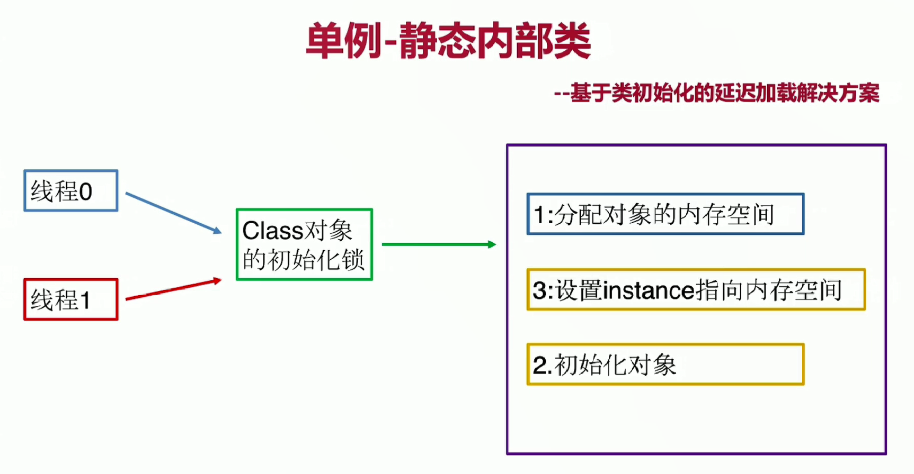

开闭原则
扩展开放,修改关闭


单例模式
确保任何情况下只有一个实例
有什么好处呢
减少内存开销
严格的控制访问

希望有的特点
私有构造器
线程安全,因为是只有一个对象,如果是一起来访问的话,就算是共享资源了,所以这个时候要保证线程安全
延迟加载,使用的时候再创建
序列化和反序列化的安全问题,以为这两个过程中可能会对单例造成破坏
反射,要防止反射攻击







两个解决办法 

不允许线程0的2和3重排序: volatile

禁止线程1看到线程0的重排序: 静态内部类




```
静态内部类初始化的时候有锁,这个锁只有一个线程能拿到,哪个线程拿到这个锁就去初始化这个内部类
这个时候该线程初始化类的过程对于另外一个线程是不可见的(因为加了锁),所以这个时候即使发生了指令重排也无所谓
```


单例的源码实例

Runtime: 饿汉式

DeskTop: 容器单例

spring: AbstractFactoryBean:

mybatis: ErrorContext: ThreadLocal

建造者模式其实好处就是按需创建,而且名字很直观,把创建方和具体的创建对象通过一个静态内部类进行了解耦,很适合于有多个成员变量的类
建造者模式实例
StringBuilder的append方法
同理StringBuffer也是一样
guava的
Immutable类
cacheBuilder
spring的BeanDefinitionBuilder
mybatis
SqlSessionFactoryBuilder
