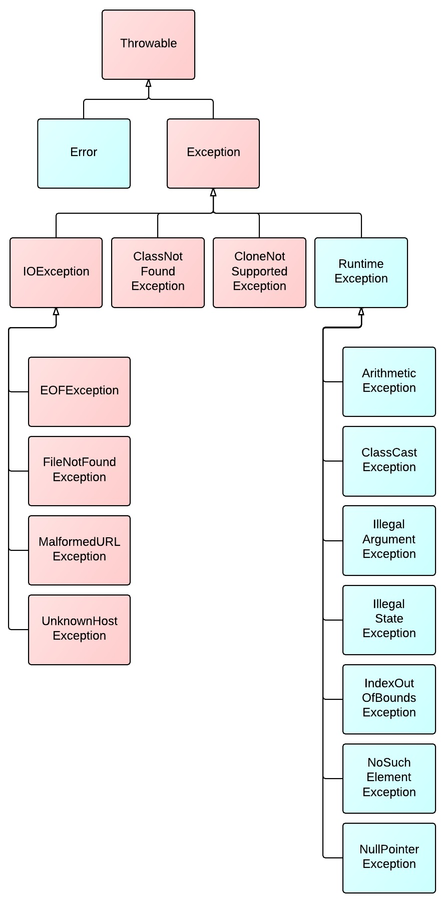

# coordinate-spring-transaction


## Java的异常体系




粉红色的是受检查的异常(checked exceptions),其必须被 try{}catch语句块所捕获,或者在方法签名里通过throws子句声明.受检查的异常必须在编译时被捕捉处理,命名为 CHecked Exception 是因为Java编译器要进行检查,Java虚拟机也要进行检查,以确保这个规则得到遵守.
绿色的异常是运行时异常(runtime exceptions),需要程序员自己分析代码决定是否捕获和处理,比如 空指针,被0除...
而声明为Error的，则属于严重错误,需要根据业务信息进行特殊处理,Error不需要捕捉。 

对于Checked异常 默认情况下spring事务不会回滚, 会提交

对于UnChecked异常 默认情况下spring事务会回滚


spring事务传播机制


入口

@Transactional

可以标注在类上和方法上

标注在类上就是对类上的所有方法都执行事务操作


方法上的优先级比类上的高


注解的一些属性


事务管理器
```
@AliasFor("transactionManager")
String value() default "";

@AliasFor("value")
String transactionManager() default "";
```


事务的传播机制
```
Propagation propagation() default Propagation.REQUIRED;
```


默认
PROPAGATION_REQUIRED
如果存在事务则支持当前事务,没有事务就创建一个

合并事务


SUPPORTS
如果存在事务则支持当前事务,没有事务就以非事务的方式去执行

MANDATORY
如果存在事务则支持当前事务,没有事务就抛出异常

REQUIRES_NEW
总是开启一个新的事务,如果一个事务已经存在则将当前事务挂起

NOT_SUPPORTED
总是以非事务的形式进行,并挂起任何存在的事务

NEVER
总是以非事务的形式进行,如果存在一个活动的事务则会抛出异常

NESTED
如果一个活动的事务已经存在,则运行在一个嵌套的事务中,如果没有活动事务则按照required执行


事务的隔离级别

```
Isolation isolation() default Isolation.DEFAULT;
```


默认DEFAULT

使用数据库的隔离级别


spring会定义隔离级别,它会映射到数据库的隔离级别上面

除了default之外其他定义的隔离级别与数据库是相似的


事务的超时时间

一个事务可以执行的最长时间,超过时间则会回滚

默认-1,即使用数据库的超时时间

```
int timeout() default TransactionDefinition.TIMEOUT_DEFAULT;
```


事务是否是只读的

默认是false

只读事务不存在修改,所以数据库会为只读事务提供一些优化手段

```
boolean readOnly() default false;
```


设置需要回滚的异常类的数组

当代码中抛出指定异常类数组中的异常的时候,事务会进行回滚

```
Class<? extends Throwable>[] rollbackFor() default {};
```


设定需要回滚的异常类名称的数组

```
String[] rollbackForClassName() default {};
```


设置不需要回滚的异常类的数组

当代码中抛出了该数组中的异常时,不需要进行回滚

```
Class<? extends Throwable>[] noRollbackFor() default {};
```


设置不需要回滚的异常类的名称的数组

```
String[] noRollbackForClassName() default {};
```


注意: 不建议使用rollbackForClassName(),noRollbackForClassName()

字符串要使用完整的包名的类,容易写错

不写全类名的话可能会导致对不同包中的同名类的回滚或者不回滚


其他

这个注解只能使用在public修饰的方法上

默认情况下,只会讲unchecked异常和runtime exception异常进行回滚

所有的check类异常都不会引起事务的回滚


事务管理器

引入jpa依赖或者jdbc依赖都会自动配置好这个事务管理器

有可能是jpa事务管理器或者是datasource事务管理器

```
public interface PlatformTransactionManager {

	//获取事务,返回一个已经激活的事务或者创建一个新的事务,返回的是一个TransactionStatus对象,抛出TransactionException
	TransactionStatus getTransaction(@Nullable TransactionDefinition definition)
			throws TransactionException;

	//提交事务
	void commit(TransactionStatus status) throws TransactionException;

	//回滚事务
	void rollback(TransactionStatus status) throws TransactionException;

}

```


TransactionStatus对象,代表的事务的状态,获取事务的状态信息

```
public interface TransactionStatus extends SavepointManager, Flushable {

	//是否是新的事务
	boolean isNewTransaction();

	//是否有保存点
	boolean hasSavepoint();

	//设置当前的事务应该回滚
	void setRollbackOnly();

	//当前的事务是否应该回滚
	boolean isRollbackOnly();

	//刷新会话到数据库
	@Override
	void flush();

	//当前事务是否已经完成
	boolean isCompleted();

}

```


参数TransactionDefinition

这个类定义了一些隔离级别和传播机制还有获取这些变量的方法

```java
public interface TransactionDefinition {

	int PROPAGATION_REQUIRED = 0;
	int PROPAGATION_SUPPORTS = 1;
	int PROPAGATION_MANDATORY = 2;
	int PROPAGATION_REQUIRES_NEW = 3;
	int PROPAGATION_NOT_SUPPORTED = 4;
	int PROPAGATION_NEVER = 5;
	int PROPAGATION_NESTED = 6;
    
	int ISOLATION_DEFAULT = -1;
	int ISOLATION_READ_UNCOMMITTED = Connection.TRANSACTION_READ_UNCOMMITTED;
	int ISOLATION_READ_COMMITTED = Connection.TRANSACTION_READ_COMMITTED;
	int ISOLATION_REPEATABLE_READ = Connection.TRANSACTION_REPEATABLE_READ;
	int ISOLATION_SERIALIZABLE = Connection.TRANSACTION_SERIALIZABLE;
	int TIMEOUT_DEFAULT = -1;

	int getPropagationBehavior();
	int getIsolationLevel();
	int getTimeout();
	boolean isReadOnly();
	@Nullable
	String getName();

}

```


